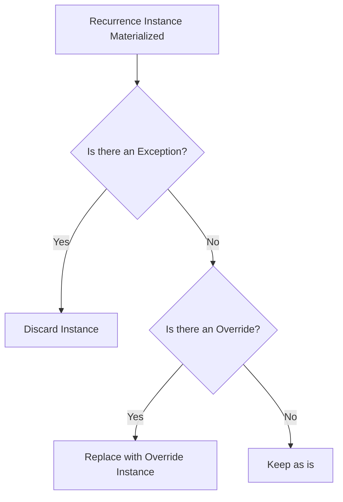

# Recurring System Architecture and Virtualization Documentation

## Overview

This document outlines the architecture and internal mechanics of the recurring system implemented in the **RecurringThings** project. The goal is to support advanced recurrence logic akin to calendar systems (e.g., Google Calendar or Outlook), with precision handling of time zones, daylight saving transitions, exceptions, and overrides. The core principle is to treat recurring entries as virtualized occurrences that do not exist physically in the database but can be materialized at query time with full fidelity.

## 1. Concepts and Definitions

### Recurrence

A **Recurrence** represents a rule for repeating a logical event over time (e.g., every Monday at 9 AM). It includes a `StartTime`, `EndTime`, a recurrence pattern (`RRule`), and a hard upper bound `RecurrenceEndTime`.

### Occurrence

An **Occurrence** is a standalone, material event with no recurrence logic attached. These are stored directly in the database.

### Virtualized Occurrence

A **VirtualizedOccurrence** is a runtime-projected instance derived from a `Recurrence`, representing what a recurrence would have generated during a specific time window. These are created on demand and are not persisted in storage.

### Occurrence Exception

An **Exception** cancels a specific instance of a recurrence. It is indexed by the **original** local datetime that would have been produced by the recurrence.

### Occurrence Override

An **Override** both cancels a specific recurrence instance and replaces it with a new `StartTime`, `EndTime`, and optionally, other descriptive fields.

## 2. Data Storage Model

The recurring system stores all temporal data in **UTC**. This guarantees consistency, supports range querying, and avoids common pitfalls with daylight saving time.

Time zone information is stored as an IANA TimeZone string (e.g., `"America/New_York"`), and is always applied using libraries like NodaTime or Ical.Net when performing calculations.

### Expected Tables and Fields

```mermaid
erDiagram
    Recurrence ||--o{ OccurrenceException : has
    Recurrence ||--o{ OccurrenceOverride : has
    Recurrence ||--o{ VirtualizedOccurrence : generates
    Occurrence ||--|| VirtualizedOccurrence : union

    Recurrence {
        Guid Id PK
        DateTime StartTime (UTC)
        DateTime EndTime (UTC)
        DateTime RecurrenceEndTime (UTC)
        string RRule
        string TimeZone
        string Description
    }

    Occurrence {
        Guid Id PK
        DateTime StartTime (UTC)
        DateTime EndTime (UTC)
        string Description
    }

    OccurrenceException {
        Guid Id PK
        Guid RecurrenceId FK
        DateTime OriginalTime (UTC)
    }

    OccurrenceOverride {
        Guid Id PK
        Guid RecurrenceId FK
        DateTime OriginalTime (UTC)
        DateTime StartTime (UTC)
        DateTime EndTime (UTC)
        string Description
    }
    
 ```

## 3. Virtualization Pipeline

When a client requests occurrences for a given time window, the system follows this precise logic:

1.  Fetch all `Recurrence` objects that **might overlap** with the requested range. This is done by filtering using `StartTime` and `RecurrenceEndTime` against the provided [start, end) window.
    
2.  Fetch all regular `Occurrence` entities in the same range.
    
3.  For each recurrence:
    
    -   Use **Ical.Net** to materialize theoretical instances based on `StartTime`, `RRule`, and `TimeZone`.
        
    -   Apply **Exception** filtering by matching original local times.
        
    -   Apply **Override** filtering by matching original UTC times, removing and replacing with custom values.
        
    -   Discard any virtual occurrence outside the provided range.
        
4.  Concatenate the standalone `Occurrence` entries with the virtualized ones.
    
5.  Return a sorted list of all occurrences in the window.
    

## 4. Database Schema

The recurring system relies on three primary persisted entities: `Recurrence`, `Occurrence`, and their related support structures: `OccurrenceException` and `OccurrenceOverride`. All persisted **date and time values are stored in UTC**, and all recurrence calculations are based on UTC and timezone identifiers to ensure consistency across daylight saving transitions and global time zones.

### Schema Description

-   **Recurrence**: Defines a recurring pattern, its start and end time, and the associated RRULE.
    
-   **Occurrence**: Represents standalone, non-recurring events.
    
-   **OccurrenceException**: Identifies recurrence instances that must be canceled.
    
-   **OccurrenceOverride**: Defines recurrence instances that must be replaced with new time or description.
    
```mermaid
erDiagram
    Recurrence {
        Guid Id
        DateTime StartTime 
        DateTime EndTime
        DateTime RecurrenceEndTime
        string RRule
        string TimeZone
        string Description
    }

    Occurrence {
        Guid Id
        DateTime StartTime
        DateTime EndTime
        string Description
    }

    OccurrenceException {
        Guid Id
        Guid RecurrenceId
        DateTime OriginalTime
    }

    OccurrenceOverride {
        Guid Id
        Guid RecurrenceId
        DateTime OriginalTime
        DateTime StartTime
        DateTime EndTime
        string Description
    }

    Recurrence ||--o{ OccurrenceException : has
    Recurrence ||--o{ OccurrenceOverride : has
```

### Runtime Virtualized Object

While `VirtualizedOccurrence` is **not persisted**, it is the **unified projection** returned by the `VirtualizationService`. This type merges all recurrence-derived occurrences (virtualized via RRULEs) and standalone `Occurrence` rows into a single flat list to facilitate client consumption, calendar rendering, or downstream processing.

## 5. Handling Time Zones and Daylight Saving

All recurrence projection is performed in the **local time zone** as defined in each `Recurrence`. This ensures daylight saving transitions are honored correctly.

To achieve this:

-   `StartTime` and `EndTime` are converted from UTC into a `ZonedDateTime` using **NodaTime**.
    
-   The local values are used to construct `CalDateTime` objects fed into Ical.Net.
    
-   Ical.Net is instructed to generate instances within that local time frame.
    
-   After materialization, all virtual occurrences are converted back to UTC.
    

This strategy allows clean interaction with iCal libraries while maintaining full control over UTC precision for querying.


## 6. Exceptions and Overrides Application Logic

Each recurrence materialization pass must account for **cancellation** and **replacement** scenarios. These are handled by two distinct components: exceptions and overrides.

-   **Exception**: Cancels a specific recurrence instance entirely. If an occurrence from the recurrence rule has a matching `OriginalTime` in the `Exceptions` list, **it must be removed**, and no override should be considered for it.
    
-   **Override**: Modifies a specific recurrence instance. If a recurrence occurrence has a matching `OriginalTime` in the `Overrides` list, it is replaced with the customized `StartTime`, `EndTime`, and `Description` defined in the override.
    

> ❗ **Important:** If both an override and an exception exist for the same `OriginalTime`, **the exception takes precedence**. The override must be ignored in this case. This ensures intentional cancellations cannot be silently bypassed by a conflicting override.

This rule ensures that users explicitly removing an occurrence (via an exception) are never overridden by unintended logic.

### Priority Order



## 7. Filtering and Clipping

All materialized occurrences are filtered against:

-   The user-provided `[start, end)` window.
    
-   The `RecurrenceEndTime` of each recurrence.
    
Although iCal rules may theoretically go on indefinitely (`COUNT=1000`, etc), the final result is **clipped** strictly to ensure no recurrence instance exceeds the defined hard cap in `RecurrenceEndTime`.

## 8. Summary and Best Practices

This system uses modern, production-ready strategies for recurrence generation:

-   All dates are stored in **UTC** to support robust filtering.
    
-   **Time zones** are respected during projection and never embedded into stored timestamps.
    
-   **Overrides** and **exceptions** are applied explicitly in a deterministic order.
    
-   **Ical.Net** and **NodaTime** are used to ensure accuracy across DST transitions.
    
-   Final occurrence sets are combined from both **virtualized** and **standalone** sources, allowing for flexibility in scheduling logic.