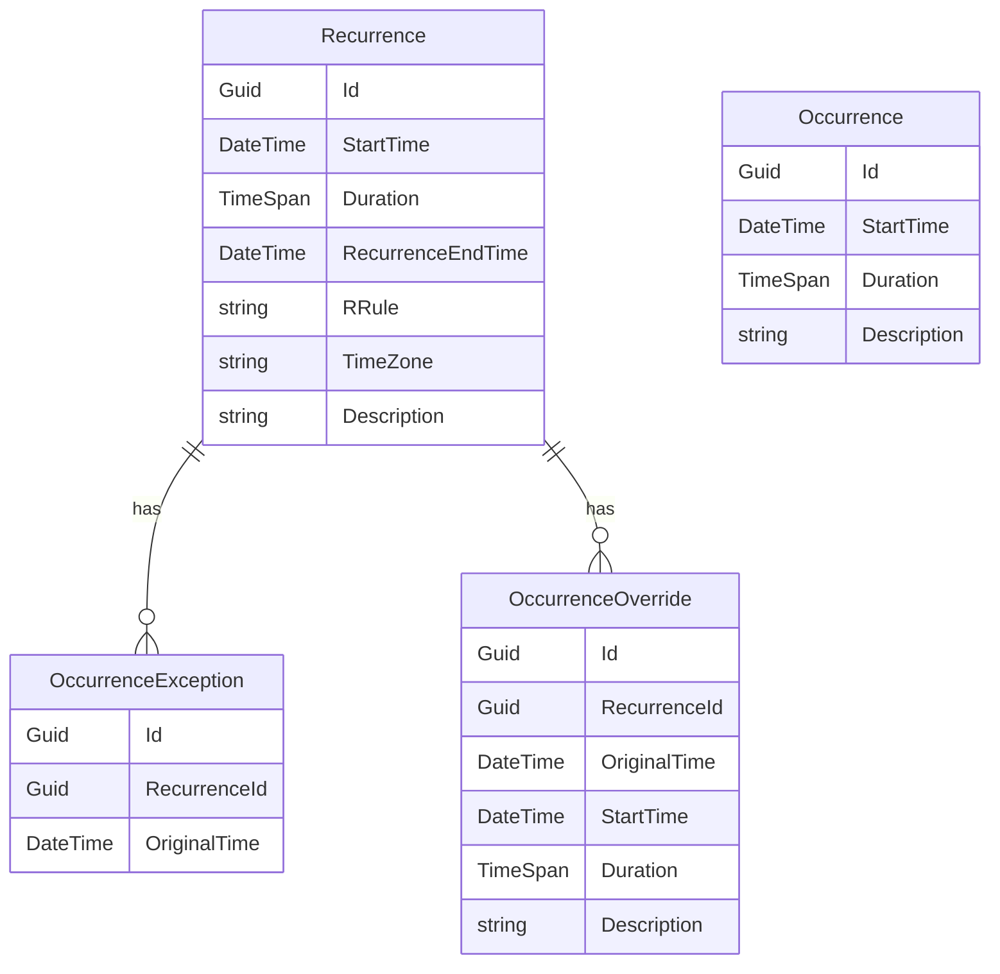
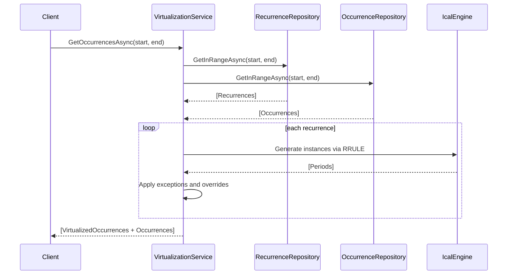
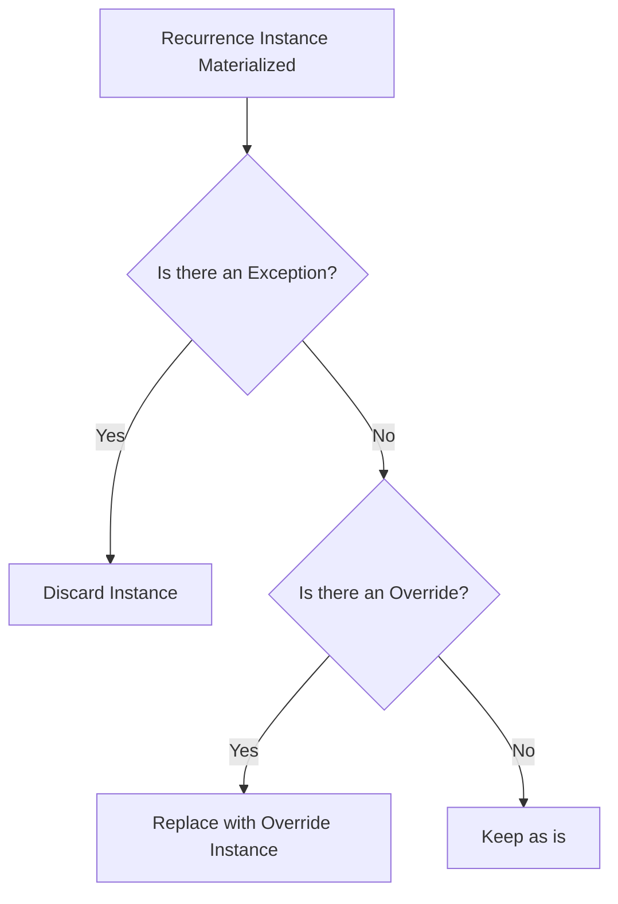

# Recurring System Architecture and Virtualization

This document explains the design and internal logic of the **RecurringThings** sample project, which demonstrates how to implement a recurrence system with support for time zones, daylight saving time, overrides, and exceptions. The system is intentionally scoped to focus on materializing occurrences for querying. Features like UI interaction, editing recurrences, or long-term audit are explicitly out of scope.

## Overview

The recurring system provides a unified view of time-based entries, whether they are standalone or generated from a recurrence pattern. Recurrences are not stored as a list of future instances. Instead, they are virtualized on demand, merged with any non-recurring occurrences and filtered for the requested date range.

This approach mirrors strategies used in modern calendar systems like Google Calendar and Microsoft Outlook. The key differentiator is the on-demand generation of instances through a **virtualization service**, while managing edge cases like daylight saving time and partial overrides.

## Recurrence Model and Data Structure

A recurrence represents a logical instruction to repeat an action or event at defined intervals. Rather than duplicating this across all future occurrences, we store a rule (`RRule`) and boundaries. For example: “Every weekday at 9AM until May 5th.”

All recurrence-based calculations are anchored in UTC and annotated with a time zone using IANA identifiers (e.g., `America/New_York`), allowing for proper reconstruction of local times during generation.

### Entity Definitions

-   **Recurrence**: Holds the pattern (RRule), time window, and time zone.
    
-   **Occurrence**: Represents a singular non-repeating event.
    
-   **OccurrenceException**: Cancels a virtualized recurrence instance at a specific point in time.
    
-   **OccurrenceOverride**: Replaces a virtualized instance with a customized one.
    
-   **VirtualizedOccurrence**: A transient runtime object that normalizes output for both real and virtual entries.
    

All `DateTime` fields in persistent storage are in **UTC**. This includes recurrence boundaries, overrides, and exception targets.

### Schema Diagram

## Virtualization Lifecycle and Execution

The virtualization service provides a single method: `GetOccurrencesAsync(DateTime startUtc, DateTime endUtc)`. This method accepts a time window in UTC and returns all occurrences — both standalone and virtualized — that fall within the range.

### Execution Flow

### Internal Process

1.  **Recurrence Filtering**  
    The repository returns only recurrences whose series intersect with the query range based on their `StartTime` and `RecurrenceEndTime`. This ensures no unrelated data is processed.
    
2.  **Time Zone Reconstruction**  
    Each recurrence's UTC values are converted to local time using the configured IANA time zone. This is required for Ical.Net to process RRULEs correctly.
    
3.  **Materialization**  
    The RRULE is applied to the recurrence using Ical.Net, producing theoretical occurrences in local time. These are then converted back to UTC.
    
4.  **Exceptions**  
    Any instance that matches an `OriginalTime` in the `OccurrenceException` list is discarded. This cancels the virtual occurrence entirely.
    
5.  **Overrides**  
    If a matching `OriginalTime` is found in `OccurrenceOverride`, the virtual occurrence is replaced with the override’s `StartTime`, `Duration`, and `Description`.
    
6.  **Filtering**  
    Results are clipped by the user’s query range and the recurrence’s `RecurrenceEndTime`.

### Exception and Override Mechanics

-   **Exception priority**: If both an exception and override exist for the same `OriginalTime`, the exception takes precedence.
    
-   **Overrides** are matched by original UTC `StartTime`, and are only included in results if the **new** `StartTime` falls within the query range.
    

> Outlook and Google Calendar refer to overrides as “Modified Occurrences.”

### Output and Merging

The final output is a flat list of `VirtualizedOccurrence` objects that normalize both recurrence-based and standalone entries. This format is ideal for calendars or timelines. If a real `Occurrence` and a virtualized one exist at the same time, both are included. No deduplication is performed.

## Time Zone Handling and Constraints

All persistence and filtering is done in **UTC**. The only exception is the **local time transformation** done temporarily inside the virtualization layer. This is needed for RRULE parsing to reflect real-world behavior, including daylight transitions.

> All time zones must use **IANA** format (`America/Chicago`, not `Central Standard Time`). Conversions are handled using NodaTime to ensure cross-platform consistency.

## Limitations and Implementation Scope

This sample is purposefully limited. The following items are out of scope:

-   **Editing or deleting recurrences**
    
-   **Retaining history when modifying a series**
    
-   **Linking cloned recurrences post-edit**
    
-   **UI interaction models**
    
-   **Error handling and validation**
    

The implementer is expected to:

-   Generate `RRule` strings from a validated high-level structure.
    
-   Design their own editing workflows.
    
-   Store additional fields by extending the `ICalendarEntry` interface and replicating them in `Recurrence`, `OccurrenceOverride`, and `Occurrence`.
    
## Extending the System

Fields like `Location`, `Color`, or `IsAllDay` can be supported by adding them to the `ICalendarEntry` interface. These fields:

-   Will be inherited by `Recurrence` and passed into each `VirtualizedOccurrence`
    
-   Can be overridden in `OccurrenceOverride` entries
    
-   Will appear uniformly in merged output