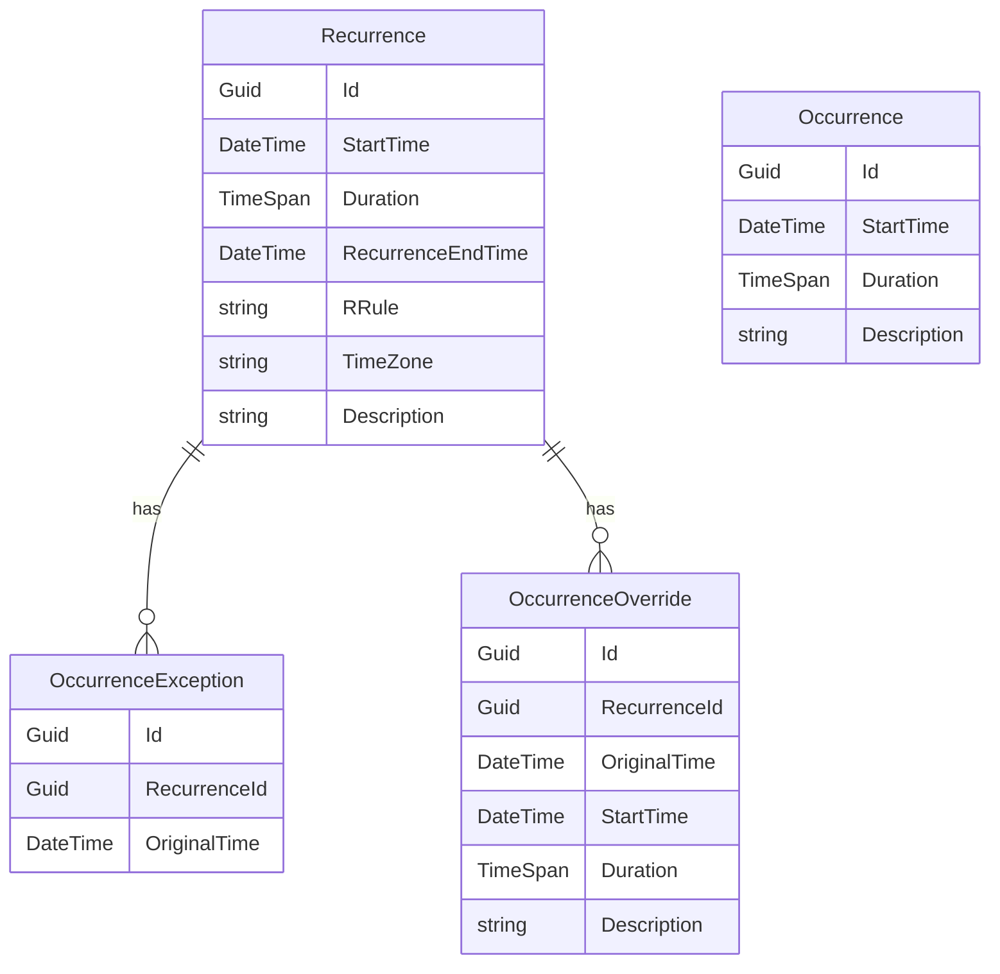
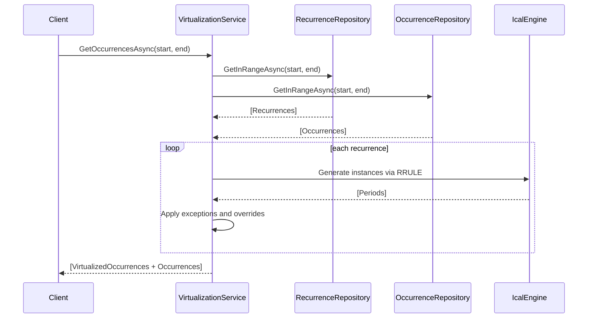
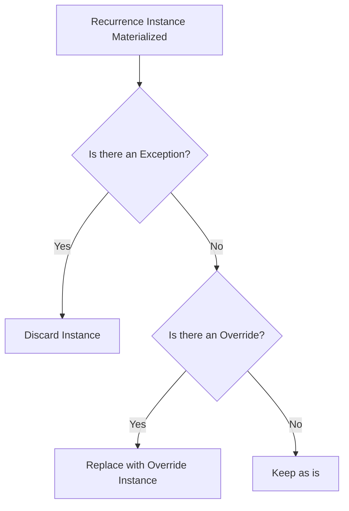

# Recurring System Architecture and Virtualization

This document explains the design and internal logic of the **RecurringThings** sample project, which demonstrates how to implement a recurrence system with support for time zones, daylight saving time, overrides, and exceptions. The system is intentionally scoped to focus on materializing occurrences for querying. Features like UI interaction, editing recurrences, or long-term audit are explicitly out of scope.

## Overview

The recurring system provides a unified view of time-based entries, whether they are standalone or generated from a recurrence pattern. Recurrences are not stored as a list of future instances. Instead, they are virtualized on demand, merged with any non-recurring occurrences and filtered for the requested date range.

This approach mirrors strategies used in modern calendar systems like Google Calendar and Microsoft Outlook. The key differentiator is the on-demand generation of instances through a **virtualization service**, while managing edge cases like daylight saving time and partial overrides.

## Recurrence Model and Data Structure

A recurrence represents a logical instruction to repeat an action or event at defined intervals. Rather than duplicating this across all future occurrences, we store a rule (`RRule`) and boundaries. For example: “Every weekday at 9AM until May 5th.”

All recurrence-based calculations are anchored in UTC and annotated with a time zone using IANA identifiers (e.g., `America/New_York`), allowing for proper reconstruction of local times during generation.

### Entity Definitions

-   **Recurrence**: Holds the pattern (RRule), time window, and time zone.
    
-   **Occurrence**: Represents a singular non-repeating event.
    
-   **OccurrenceException**: Cancels a virtualized recurrence instance at a specific point in time.
    
-   **OccurrenceOverride**: Replaces a virtualized instance with a customized one.
    
-   **VirtualizedOccurrence**: A transient runtime object that normalizes output for both real and virtual entries.
    

All `DateTime` fields in persistent storage are in **UTC**. This includes recurrence boundaries, overrides, and exception targets.

### Schema Diagram



## Virtualization Lifecycle and Execution

The virtualization service provides a single method: `GetOccurrencesAsync(DateTime startUtc, DateTime endUtc)`. This method accepts a time window in UTC and returns all occurrences — both standalone and virtualized — that fall within the range.

### Execution Flow



### Internal Process

1.  **Recurrence Filtering**  
    The repository returns only recurrences whose series intersect with the query range based on their `StartTime` and `RecurrenceEndTime`. This ensures no unrelated data is processed.
    
2.  **Time Zone Reconstruction**  
    Each recurrence's UTC values are converted to local time using the configured IANA time zone. This is required for Ical.Net to process RRULEs correctly.
    
3.  **Materialization**  
    The RRULE is applied to the recurrence using Ical.Net, producing theoretical occurrences in local time. These are then converted back to UTC.
    
4.  **Exceptions**  
    Any instance that matches an `OriginalTime` in the `OccurrenceException` list is discarded. This cancels the virtual occurrence entirely.
    
5.  **Overrides**  
    If a matching `OriginalTime` is found in `OccurrenceOverride`, the virtual occurrence is replaced with the override’s `StartTime`, `Duration`, and `Description`.
    
6.  **Filtering**  
    Results are clipped by the user’s query range and the recurrence’s `RecurrenceEndTime`.

### Exception and Override Mechanics



-   **Exception priority**: If both an exception and override exist for the same `OriginalTime`, the exception takes precedence.
    
-   **Overrides** are matched by original UTC `StartTime`, and are only included in results if the **new** `StartTime` falls within the query range.
    

> Outlook and Google Calendar refer to overrides as “Modified Occurrences.”

### Output and Merging

The final output is a flat list of `VirtualizedOccurrence` objects that normalize both recurrence-based and standalone entries. This format is ideal for calendars or timelines. If a real `Occurrence` and a virtualized one exist at the same time, both are included. No deduplication is performed.

## Time Zone Handling and Constraints

All persistence and filtering is done in **UTC**. The only exception is the **local time transformation** done temporarily inside the virtualization layer. This is needed for RRULE parsing to reflect real-world behavior, including daylight transitions.

> All time zones must use **IANA** format (`America/Chicago`, not `Central Standard Time`). Conversions are handled using NodaTime to ensure cross-platform consistency.

## Limitations and Implementation Scope

This sample is purposefully limited. The following items are out of scope:

-   **Editing or deleting recurrences**
    
-   **Retaining history when modifying a series**
    
-   **Linking cloned recurrences post-edit**
    
-   **UI interaction models**
    
-   **Error handling and validation**
    

The implementer is expected to:

-   Generate `RRule` strings from a validated high-level structure.
    
-   Design their own editing workflows.
    
-   Store additional fields by extending the `ICalendarEntry` interface and replicating them in `Recurrence`, `OccurrenceOverride`, and `Occurrence`.
    
## Extending the System

Fields like `Location`, `Color`, `IsAllDay` or any other field specific to different types of occurrence such as tasks or appointments can be supported by adding them to the `ICalendarEntry` interface. These fields:

-   Will be inherited by `Recurrence` and passed into each `VirtualizedOccurrence`
    
-   Can be overridden in `OccurrenceOverride` entries
    
-   Will appear uniformly in merged output

## Benchmarks

This benchmark measures the performance of iCal.NET when generating recurring event occurrences over a one-year period. It compares single-threaded and multi-threaded approaches across a range of recurrence rule complexities to evaluate scalability and efficiency under realistic calendar scenarios.

### Ical.Net v4

```
BenchmarkDotNet v0.14.0, Windows 11 (10.0.22631.5189/23H2/2023Update/SunValley3)
AMD Ryzen 9 3900X, 1 CPU, 24 logical and 12 physical cores
.NET SDK 8.0.200
  [Host]   : .NET 8.0.2 (8.0.224.6711), X64 RyuJIT AVX2 [AttachedDebugger]
  .NET 8.0 : .NET 8.0.2 (8.0.224.6711), X64 RyuJIT AVX2

Job=.NET 8.0  Runtime=.NET 8.0  
```

| Method          | Case                 | Mean         | Error      | StdDev     | Ratio | RatioSD | Gen0      | Gen1     | Gen2     | Allocated   | Alloc Ratio |
|---------------- |--------------------- |-------------:|-----------:|-----------:|------:|--------:|----------:|---------:|---------:|------------:|------------:|
| **Single-Threaded** | **Daily**                | **11,137.21 μs** | **222.206 μs** | **608.285 μs** |  **1.00** |    **0.08** | **2484.3750** | **765.6250** | **250.0000** | **20175.88 KB** |        **1.00** |
| Multi-Threaded  | Daily                |  8,349.09 μs | 166.404 μs | 216.372 μs |  0.75 |    0.04 | 2671.8750 | 781.2500 | 281.2500 | 21528.67 KB |        1.07 |
|          |         |            |             |
| **Single-Threaded** | **Daily until 2021**     | **10,823.55 μs** | **215.321 μs** | **301.850 μs** |  **1.00** |    **0.04** | **2484.3750** | **765.6250** | **250.0000** | **20177.49 KB** |        **1.00** |
| Multi-Threaded  | Daily until 2021     |  8,453.32 μs | 166.411 μs | 184.965 μs |  0.78 |    0.03 | 2687.5000 | 765.6250 | 265.6250 | 21570.39 KB |        1.07 |
|          |         |            |             |
| **Single-Threaded** | **Monthly (1st Friday)** |    **242.24 μs** |   **4.831 μs** |  **10.400 μs** |  **1.00** |    **0.06** |   **82.2754** |  **12.4512** |        **-** |   **673.88 KB** |        **1.00** |
| Multi-Threaded  | Monthly (1st Friday) |    361.40 μs |   6.959 μs |   6.834 μs |  1.49 |    0.07 |  206.0547 |  60.5469 |        - |  1672.47 KB |        2.48 |
|          |         |            |             |
| **Single-Threaded** | **Weekl(...)d/Fri [21]** |  **3,351.13 μs** |  **65.171 μs** |  **93.466 μs** |  **1.00** |    **0.04** | **1054.6875** | **792.9688** |        **-** |  **8627.74 KB** |        **1.00** |
| Multi-Threaded  | Weekl(...)d/Fri [21] |  3,557.36 μs |  69.883 μs |  65.368 μs |  1.06 |    0.03 | 1390.6250 | 867.1875 | 109.3750 | 11310.39 KB |        1.31 |
|          |         |            |             |
| **Single-Threaded** | **Yearly on Dec 25**     |     **24.75 μs** |   **0.481 μs** |   **1.066 μs** |  **1.00** |    **0.06** |    **7.9956** |   **0.2441** |        **-** |    **65.46 KB** |        **1.00** |
| Multi-Threaded  | Yearly on Dec 25     |    144.12 μs |   2.828 μs |   3.677 μs |  5.83 |    0.28 |   34.1797 |   1.9531 |        - |   278.83 KB |        4.26 |


### Ical.Net 5.0.0-pre.42

```
BenchmarkDotNet v0.14.0, Windows 11 (10.0.22631.5189/23H2/2023Update/SunValley3)
AMD Ryzen 9 3900X, 1 CPU, 24 logical and 12 physical cores
.NET SDK 8.0.200
  [Host]   : .NET 8.0.2 (8.0.224.6711), X64 RyuJIT AVX2 [AttachedDebugger]
  .NET 8.0 : .NET 8.0.2 (8.0.224.6711), X64 RyuJIT AVX2

Job=.NET 8.0  Runtime=.NET 8.0  
```
| Method          | Case                 | Mean       | Error      | StdDev     | Median     | Ratio | RatioSD | Gen0     | Gen1    | Allocated  | Alloc Ratio |
|---------------- |--------------------- |-----------:|-----------:|-----------:|-----------:|------:|--------:|---------:|--------:|-----------:|------------:|
| **Single-Threaded** | **Daily**                | **825.734 μs** | **16.5063 μs** | **46.0129 μs** | **811.032 μs** |  **1.00** |    **0.08** | **139.6484** |  **3.9063** | **1144.97 KB** |        **1.00** |
| Multi-Threaded  | Daily                | 381.061 μs |  5.9635 μs |  5.2864 μs | 381.171 μs |  0.46 |    0.03 | 193.3594 | 23.4375 | 1578.35 KB |        1.38 |
|                 |                      |            |            |            |            |       |         |          |         |            |             |
| **Single-Threaded** | **Daily until 2021**     | **846.583 μs** | **16.5709 μs** | **21.5468 μs** | **843.998 μs** |  **1.00** |    **0.04** | **139.6484** |  **3.9063** | **1145.15 KB** |        **1.00** |
| Multi-Threaded  | Daily until 2021     | 391.859 μs |  7.7368 μs | 15.2716 μs | 386.758 μs |  0.46 |    0.02 | 194.8242 | 23.9258 | 1582.66 KB |        1.38 |
|                 |                      |            |            |            |            |       |         |          |         |            |             |
| **Single-Threaded** | **Monthly (1st Friday)** |  **43.174 μs** |  **0.8342 μs** |  **0.9930 μs** |  **43.102 μs** |  **1.00** |    **0.03** |   **7.8125** |  **0.1221** |    **64.2 KB** |        **1.00** |
| Multi-Threaded  | Monthly (1st Friday) | 149.798 μs |  2.9955 μs |  4.6636 μs | 149.301 μs |  3.47 |    0.13 |  40.5273 |  2.4414 |  331.24 KB |        5.16 |
|                 |                      |            |            |            |            |       |         |          |         |            |             |
| **Single-Threaded** | **Weekl(...)d/Fri [21]** | **434.560 μs** |  **8.6911 μs** | **12.4646 μs** | **430.627 μs** |  **1.00** |    **0.04** |  **71.2891** |  **1.4648** |  **585.44 KB** |        **1.00** |
| Multi-Threaded  | Weekl(...)d/Fri [21] | 286.266 μs |  4.7300 μs |  3.9497 μs | 286.438 μs |  0.66 |    0.02 | 122.0703 | 12.6953 |  990.83 KB |        1.69 |
|                 |                      |            |            |            |            |       |         |          |         |            |             |
| **Single-Threaded** | **Yearly on Dec 25**     |   **7.735 μs** |  **0.1538 μs** |  **0.2611 μs** |   **7.710 μs** |  **1.00** |    **0.05** |   **1.5259** |  **0.0153** |   **12.54 KB** |        **1.00** |
| Multi-Threaded  | Yearly on Dec 25     | 120.923 μs |  2.1355 μs |  1.7832 μs | 121.517 μs | 15.65 |    0.56 |  28.3203 |  1.4648 |  232.71 KB |       18.56 |


